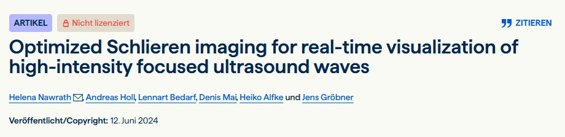

Nawrath H., Holl A., **Bedarf, L.**, Mai D., Alfke H., Gröbner J.(2024).
*Optimized Schlieren imaging for real-time visualization of high-intensity focused ultrasound waves*.
**Biomedical Engineering / Biomedizinische Technik**.
[DOI: 10.1515/bmt-2024-0002](https://doi.org/10.1515/bmt-2024-0002){targes="_blank"}

