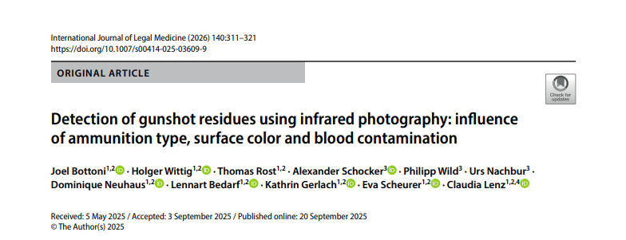

Bottoni J., Wittig H., Rost T., Schocker S., Wild P., Nachbur U., Neuhaus D., **Bedarf, L.**, Gerlach K., Scheurer E., Lenz C. (2025).
*Detection of gunshot residues using infrared photography: influence of ammunition type, surface color and blood contamination*.
**Int J Legal Med**, *140*, 311-321.
[DOI: 10.1007/s00414-025-03609-9](https://doi.org/10.1007/s00414-025-03609-9){targes="_blank"}

