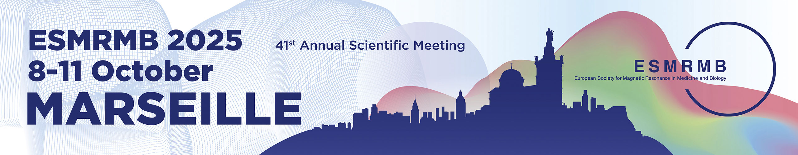

<strong>Bedarf, L.</strong>, Neuhaus D., Wendebourg M.&thinsp;J., Schlaeger R., Birkl C., Scheurer E., Lenz C. (2025).
<em>Quantifying the Impact of Formalin Fixation on R2* Orientation Dependency in Human Brain White Matter</em>

{width=100% height=1000px}

